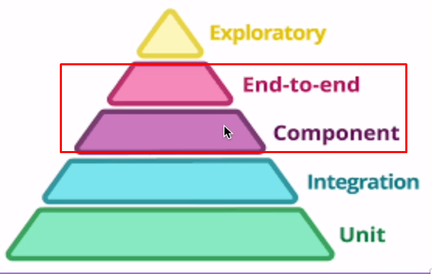

<h1 align="center">
  StarWars Planet API (sw-planet-api)
</h1>

<p align="center">
  <a href="#-technologies">Tecnologias</a>&nbsp;&nbsp;&nbsp;|&nbsp;&nbsp;&nbsp;
  <a href="#-introdução">Introdução</a>&nbsp;&nbsp;&nbsp;&nbsp;&nbsp;&nbsp;
</p>

<p align="center">
  
</p>

# Estudo Testes Subcutâneos

## Referência: Testes automatizados na prática com Spring Boot
[Compre aqui](https://www.udemy.com/course/testes-automatizados-na-pratica-com-spring-boot/)
<hr>

## Dica para leitura:
Durante o estudo, os códigos mudam pois geralmente é ensinado algo básico onde depois iremos implementar o que de fato
é utilizado no mercado de trabalho. Tome cuidado ao considerar códigos do início do estudo, se atente ao código final.

## ✨ Technologies

- [Mysql](https://dev.mysql.com/downloads/mysql/)
- [Java](https://www.oracle.com/java/technologies/downloads/)
- [Maven](https://maven.apache.org/download.cgi)
- [Spring Boot](https://spring.io/projects/spring-boot)
- [Spring Testing](https://docs.spring.io/spring-framework/docs/current/reference/html/testing.html#testing-introduction)
- [JUnit 5](https://junit.org/junit5/docs/current/user-guide/)
- [Mockito](https://site.mockito.org)
- [AssertJ](https://github.com/assertj/assertj)
- [Hamcrest](http://hamcrest.org/JavaHamcrest/)
- [Jacoco](https://github.com/jacoco/jacoco)
- [Pitest](https://pitest.org)

## Tópicos

<!-- TOC -->
* [Estudo Testes Subcutâneos](#estudo-testes-subcutâneos)
  * [Referência: Testes automatizados na prática com Spring Boot](#referência-testes-automatizados-na-prática-com-spring-boot)
  * [Dica para leitura:](#dica-para-leitura)
  * [✨ Technologies](#-technologies)
  * [Tópicos](#tópicos)
<hr>

* [💻 Introdução](#-introdução)
<hr>

* [🛠️ Configuração do servidor de aplicação](#-configuração-do-servidor-de-aplicação)
* [🛠️ Configuração do banco MySQL: profiles de teste](#-configuração-do-banco-mysql-profiles-de-teste)
<hr>

* [🧪 Testando cadastro de usuário com sucesso](#-testando-cadastro-de-usuário-com-sucesso)
  * [Primeiro caso de uso - Criação de planeta](#primeiro-caso-de-uso---criação-de-planeta)
  * [🛠️ Configurando rollback para os testes](#-configurando-rollback-para-os-testes)
  * [❓ Como limpar depois de cada teste o que foi inserido no banco de dados?](#-como-limpar-depois-de-cada-teste-o-que-foi-inserido-no-banco-de-dados) 
<hr>

* [️🛠️ Testando consulta de planeta com sucesso](#-testando-consulta-de-planeta-com-sucesso)
<hr>

* [✅ Exercícios](#-exercícios)
* [Exercício - Testando consulta por nome, listagem e remoção de planeta](#exercício---testando-consulta-por-nome-listagem-e-remoção-de-planeta)
    * [Consulta Por Nome](#consulta-por-nome)
  * [Consulta de planeta em listagem (all, climate e terrain)](#consulta-de-planeta-em-listagem-all-climate-e-terrain)
  * [Delete por ID](#delete-por-id)
  * [WebTestClient](#webtestclient)
    * [Usando TestRestTemplate](#usando-testresttemplate)
    * [WebTestClient](#webtestclient-1)
<hr>

* [📖 Resumo](#-resumo)
<!-- TOC -->


<hr>


# 💻 Introdução

Aqui trabalharemos com teste de componente e end-to-end.



As vantagens destes testes é trazer mais segurança, porque ele testa tudo junto! A integração de controller, service e
repository.

Aqui não teremos Mocks, então veremos de fato como ele funciona na vida real (banco, servidor de aplicação).

Não teremos também, vários cenários de teste. Somente testes que nos permitem ver o cenário principal da aplicação. Se
o essencial está funcionando.

**Para estes testes, usaremos um cenário real: servidor tomcat + banco de dados mySQL.**

<hr>

## 🛠️ Configuração do servidor de aplicação

Atualmente os nossos testes rodam em um servidor mockado. Agora, criaremos um teste que utilize um servidor real.

1. Criaremos uma classe chamada PlanetIT dento fora dos pacotes. 

Destacando que, se tivéssemos outros controllers/services seria interessante separar essa classe por domínios. Como
aqui só trabalhamos com Planetas, podemos fazer fora dos pacotes dessa forma.
<hr>

2. Essa classe irá separar entre os testes mais baratos de se executar dos testes mais caros. Agora, faremos os mais
caros, então não seria interessante executar sempre.
<hr>

3. Como esses testes são pesados, trabalharemos somente com cenários de sucesso.


4. Passaremos a anotação @SpringBootTest para subir o servidor de aplicação.

Essa anotação não só sobe o servidor, mas também cria o contexto de aplicação de Spring
e colocar todos os Beans nele. Com isso podemos testar, por exemplo, se existe algum
problema de configuração nos Beans do nosso projeto.


5. Criaremos o método contextLoads(). Caso ocorra algum erro, o teste irá falhar.

PS: Não fica NADA dentro dele, é só criação do método com o @Test. O Spring por sí só
consegue testar o carregamento da aplicação (graças a @SpringBootTest).

6. Como usar um servidor real Tomcat?.

A anotação @SpringBootTest recebe alguns parâmetros, como, por exemplo, o ambiente web
a ser utilizado juntamente com a porta utilizada. Geralmente é a 8080, mas como é teste
e para não dar conflito, usaremos uma aleatoria, veja:
``@SpringBootTest(webEnvironment = WebEnvironment.RANDOM_PORT)``.
<hr>

## 🛠️ Configuração do banco MySQL: profiles de teste

Faremos agora essa classe utilizar o banco MySQL e não o H2.

Trabalharemos com um conceito novo, chamado Profiles.

Na nossa aplicação, nós temos diferentes tipos de perfil para teste. Exemplo: Temos os nossos
testes mais leves, que são os de unidade que ficam no banco H2.

Mas nosso teste de integração (componente e end-to-end) será executado no banco MySQL. Então temos duas necessidades
diferentes para os nossos testes, pois são de tipos diferentes. Por isso nesses cenários utilizamos profiles, perfis
diferentes. Faremos o seguinte:

1. Selecionaremos um perfil para este teste, usando @ActiveProfiles(""it"), dando o nome a ele de IT, sufixo da nossa
classe (integration test).
<hr>

2. Precisamos fazer um application.properties para esse teste de integração. Ela se chamará ``application-it.properties``.
```properties
# Schema Initialization
# Vai criar a tabela planet no banco assim que iniciada, pois ainda não
# existe
string.jpa.hibernate.dll-auto=update

# Database
spring.datasource.url=${MYSQL_HOST:jdbc:mysql://localhost/starwars?useSSL=false}
spring.datasource.username=${MYSQL_USERNAME:user}
spring.datasource.password=${MYSQL_PASSWORD:senha}
```
<hr>

## 🧪 Testando cadastro de usuário com sucesso

Agora, implementaremos os testes subcutâneos. Como são testes do topo da piramide, só trabalharemos com cenários de 
sucesso.

### Primeiro caso de uso - Criação de planeta
Como é um teste end-to-end, chamaremos o controller/serviço web que estará rodando e teremos a resposta, conferindo se é
o que esperávamos.

1. Para invocar esse service, usaremos o componente RestTemplate. Mas usaremos o específico para testes, chamado
TestRestTemplate.

Como o SpringBootTest configura e inicia nossos Beans, usaremos @AutoWired no restTemplate.
<hr>

2. Criaremos o método ``createPlanet_ReturnsCreated``.
<hr>

3. Usaremos o restTemplate para chamar o service de criação de planeta.

Ele tem um método http postForEntity, que iremos utilizar. o forEntity traduz a resposta (que é um JSON) e serializamos 
em uma entidade automaticamente (que iremos informar).

Esse método possui 3 parâmetros (url, request(o que estamos criando), responseType(tipo da resposta, para que tenha
serialização)). Colocaremos o retorno disso dentro de um sut do tipo ResponseEntity<Planet>.

**Com isso, podemos verificar o status da requisição, o retorno, então faremos as Assertions.**

4. Usaremos o assertThat para verificar se o status do sut é igual a created.
<hr>

Uma outra coisa, é que como são testes end-to-end, agora teremos ID's que serão geradas automaticamente pelo banco.

Então podemos verificar:

1. se o id não é vazio:

```java
assertThat(sut.getBody().getId()).isNotNull();
```
<hr>

2. O nome do planeta, clima e terreno:

```java
assertThat(sut.getBody().getName()).isEqualTo(PLANET.getName());
assertThat(sut.getBody().getClimate()).isEqualTo(PLANET.getClimate());
assertThat(sut.getBody().getTerrain()).isEqualTo(PLANET.getTerrain());
```

Código final:
O codigo abaixo possui um erro, veja na [sessão abaixo](#configurando-rollback-para-os-testes)

```java

@ActiveProfiles("it")
@SpringBootTest
public class PlanetIT {

    @Autowired
    TestRestTemplate restTemplate;

    @Test
    public void createPlanet_ReturnsCreated() {
        ResponseEntity<Planet> sut = restTemplate.postForEntity("/planets", PLANET, Planet.class);

        assertThat(sut.getStatusCode()).isEqualTo(HttpStatus.CREATED);
        assertThat(sut.getBody().getId()).isNotNull();
        assertThat(sut.getBody().getName()).isEqualTo(PLANET.getName());
        assertThat(sut.getBody().getClimate()).isEqualTo(PLANET.getClimate());
        assertThat(sut.getBody().getTerrain()).isEqualTo(PLANET.getTerrain());
    }
}
```
<hr>

## 🛠️ Configurando rollback para os testes

Se rodarmos o código acima duas vezes, irá dar um erro. Porque o planeta que queremos já foi criado.

A gente não pode persistir dados de forma fixa no banco. Isso deixa os testes frágeis.

### ❓ Como limpar depois de cada teste o que foi inserido no banco de dados?

Usaremos um script de dados, que irá limpar (truncar) a tabela de planetas após cada execução de testes.

1. Criar no resources (de teste), um arquivo chamado remove_planets.sql.

Dentro dele, passar : `TRUNCATE TABLE  planets;`
<hr>

2. No código de teste, dizer para ele rodar esse script depois da execução de cada método.

Usaremos o @SQL, que já vimos previamente. ``@Sql(scripts = "/remove_planets.sql", executionPhase = Sql.ExecutionPhase.AFTER_TEST_METHOD)``.

O executionPhase é a fase de execução que rodaremos esse Script, usaremos ExecutionPhase.AFTER_TEST_METHOD.

Poderia ser antes de cada teste ou depois também. Depois de criar o planeta, ele será removido, podendo usar esse teste
quantas vezes quisermos.
<hr>

## ️🛠️ Testando consulta de planeta com sucesso

Aqui teremos uma consulta de planeta por ID. Será semelhante ao teste acima, porém com umas coisas a mais.

1. Criaremos o método: ``public void getPlanet_ReturnsPlanet()``.
<hr>

2. Faremos a requisição com o restTemplate, mas agora será o GET. 

Como estamos trabalhando com requisição de dados, precisamos fazer uma carga de dados para ser consultado.
Para não inserir isso manualmente, usaremos o script SQL.
<hr>

3. Podemos criar vários @SQL em cima do método, escolhendo quando inciá-los. Usaremos aquele import_planets,
mas dessa vez usando o ".BEFORE_TEST_METHOD".
<hr>

4. No sut, podemos passar o número "1", na url pois é uma ID existente no script SQL.
<hr>

5. Fazer a asserção dos dados com o getStatusCode, vendo se é igual a OK. 
<hr>

6. Podemos checar o corpo da requisição usando as [Contrants](https://github.com/zenonxd/estudo-testes-subcutaneos/blob/main/src/test/java/com/demo/swplanetapi/common/PlanetConstrants.java) 
criadas no outro arquivo.

Podemos ver então se o body do sut é igual a variável que estamos testando, neste caso, TATOOINE.
<hr>


# ✅ Exercícios

## Exercício - Testando consulta por nome, listagem e remoção de planeta

### Consulta Por Nome

Igual a consulta de cima, a diferença é aqui aqui temos o /name, para especificar o planeta.

```java
    @Test
    public void getPlanetByName_ReturnsPlanet() {
        ResponseEntity<Planet> sut = restTemplate.getForEntity("/planets/name/" + TATOOINE.getName(), Planet.class);

        assertThat(sut.getStatusCode()).isEqualTo(HttpStatus.OK);
        assertThat(sut.getBody()).isEqualTo(TATOOINE);
    }
```
<hr>

## Consulta de planeta em listagem (all, climate e terrain)

Aqui, fizemos um ajuste. Para chamar o getForEntity, especificamos que chamaremos um Array de objeto Planet.

Unica diferença do all para climate e terrain, é que o retorno do array será somente 1 planeta, como pode ser visto no
hasSize().
```java
    @Test
    public void listPlanets_ReturnsAllPlanets() {
        ResponseEntity<Planet[]> sut = restTemplate.getForEntity("/planets", Planet[].class);

        assertThat(sut.getStatusCode()).isEqualTo(HttpStatus.OK);
        assertThat(sut.getBody()).hasSize(3);
        assertThat(sut.getBody()[0]).isEqualTo(TATOOINE);
    }

    @Test
    public void listPlanets_ByClimate_ReturnsPlanets() {
        ResponseEntity<Planet[]> sut = restTemplate.getForEntity("/planets?climate=" + TATOOINE.getClimate(), Planet[].class);
    
        assertThat(sut.getStatusCode()).isEqualTo(HttpStatus.OK);
        assertThat(sut.getBody()).hasSize(1);
        assertThat(sut.getBody()[0]).isEqualTo(TATOOINE);
    }
    
    @Test
    public void listPlanets_ByTerrain_ReturnsPlanets() {
        ResponseEntity<Planet[]> sut = restTemplate.getForEntity("/planets?terrain=" + TATOOINE.getTerrain(), Planet[].class);
    
        assertThat(sut.getStatusCode()).isEqualTo(HttpStatus.OK);
        assertThat(sut.getBody()).hasSize(1);
        assertThat(sut.getBody()[0]).isEqualTo(TATOOINE);
    }
```
<hr>

## Delete por ID

Aqui tivemos um ajuste. No restTemplate possuímos vários métodos Http, mas quando usamos delete, se retorna um **void**.

Para que possamos verificar o código retornado, usamos um método genérico, o **exchange**. Nós passamos os parâmetros
para que ele faça uma chamada Http e retorne uma ResponseEntity (mesmo que seja void, que é o nosso caso).

Passamos: ``1º a url + o id do planeta, 2º verbo http (o delete),3º null (n precisa passar requestEntity, a requisição
não terá nenhuma informação passada no corpo dela, 4º Void.Class (responseType), corpo de resposta vazio, como pode ver
em <Void> sut 👇) ``
```java
    @Test
    public void removePlanet_ReturnsNoContent() {
        ResponseEntity<Void> sut = restTemplate.exchange("/planets/" + TATOOINE.getId(), HttpMethod.DELETE, null, Void.class);

        assertThat(sut.getStatusCode()).isEqualTo(HttpStatus.NO_CONTENT);
    }
```
<hr>

## WebTestClient

No Spring 5, foi introduzido um cliente web reativo (parte do módulo Webflux), o WebClient, e sua versão para testes, 
o WebTestClient. Ele surgiu como um substituto para o RestTemplate, pois utiliza uma abordagem não bloqueante para fazer 
requisições e ainda permite utilizar uma linguagem fluente, bem mais tranquila de entender.

### Usando TestRestTemplate
```java
@Test
public void createPlanet_ReturnsCreated() {
  ResponseEntity<Planet> sut = 
    restTemplate.postForEntity("/planets", PLANET, Planet.class);
 
  assertThat(sut.getStatusCode()).isEqualTo(HttpStatus.CREATED);
  assertThat(sut.getBody().getId()).isNotNull();
  assertThat(sut.getBody().getName()).isEqualTo(PLANET.getName());
  // Omitidos por simplicidade
}
```
Observe que o método postForEntity recebe vários parâmetros para fazer uma requisição post para o serviço web que 
estamos testando. Agora olha a versão com o WebTestClient:
<hr>

###  WebTestClient

```java
@Test
public void createPlanet_ReturnsCreated() {
  Planet sut = webTestClient.post().uri("/planets").bodyValue(PLANET)
    .exchange().expectStatus().isCreated().expectBody(Planet.class)
    .returnResult().getResponseBody();
 
  assertThat(sut.getId()).isNotNull();
  assertThat(sut.getName()).isEqualTo(PLANET.getName());
  // Omitidos por simplicidade
}
```
A requisição é construída de forma fluente, onde cada parâmetro é informado num método específico que o utiliza, 
trazendo uma espécie de semântica melhor à requisição HTTP.
<hr>

# 📖 Resumo

Lembrar que aqui testaremos a integração do controll, service e repository.

Não teremos Mocks.

Não teremos vários cenários de testes, somente o essencial.

Usaremos cenário real: tomcat + banco mySQL.

[Criar classe específica](#-configurando-rollback-para-os-testes) para os testes de integração.

[Fazer a classe utilizar banco mySQL](#-configuração-do-banco-mysql-profiles-de-teste).

Implementar [rollback](#-configurando-rollback-para-os-testes).

Nos testes:

Chama o restTemplate, obtém o resultado da requisição e depois verifica o que você quer (seja status de resposta ou corpo).

<hr>


